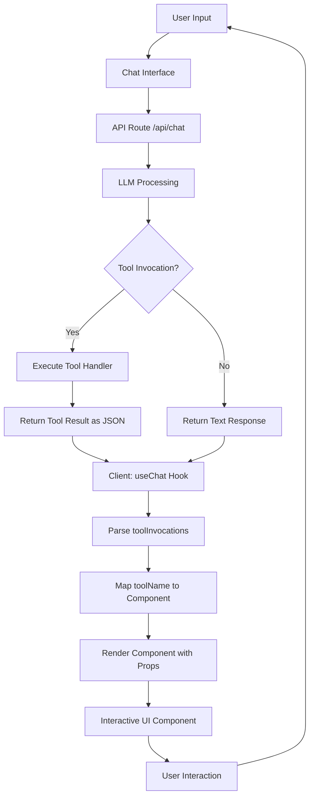

# Generative UI Dashboard

Next.js app where an LLM dynamically renders interactive React components based on user requests.

## The "Why": Client-Side Tool Mapping

Uses **Client-Side Tool Mapping** instead of experimental `ai/rsc`/`streamUI` for stability and control. Server returns tool invocations as JSON; client maps them to React components.

## Architecture




## Features

- **StockCard**: Stock info with mini-chart (symbol, price, delta)
- **WeatherWidget**: Weather display (location, temp, condition)
- **KanbanBoard**: 3-column task board

## Tech Stack

Next.js 14+ (App Router), Vercel AI SDK (`ai/react`), Tailwind + Shadcn/UI, Zod, Recharts, Lucide React

## Getting Started

```bash
npm install
npm run dev
```

## Development Phases

1. ✅ Phase 1: Project Setup & README
2. Phase 2: Component Library (The Tools)
3. Phase 3: Server-Side Logic (API)
4. Phase 4: Client-Side Integration
5. Phase 5: Polish & UI Wrapper
